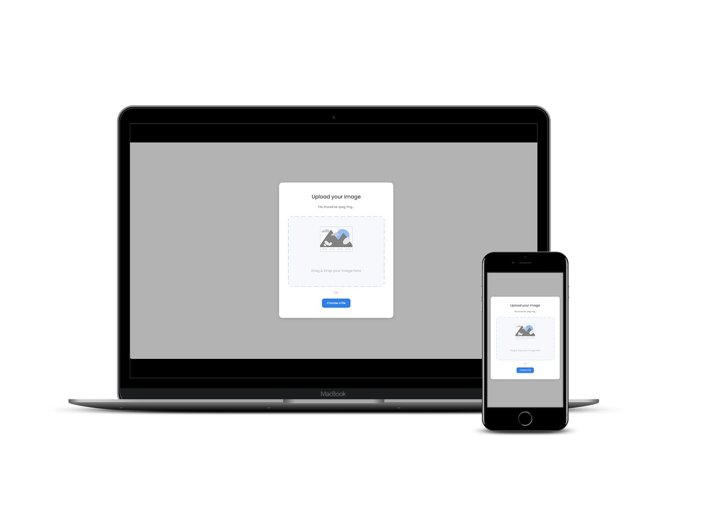

<!-- Please update value in the {}  -->

<h1 align="center">DI Image Uploader</h1>

   Solution for a challenge from  <a href="http://devchallenges.io" target="_blank">Devchallenges.io</a>.

  <h3>
    <a href="https://file-uploader.diazevedo.com/">
      Demo
    </a>
     | 
    <a href="https://devchallenges.io/solutions/5ggSHtG6PJtosK8lMzws">
      Solution
    </a>
     | 
    <a href="https://devchallenges.io/challenges/O2iGT9yBd6xZBrOcVirx">
      Challenge
    </a>
  </h3>

## Table of Contents

- [Overview](#overview)
  - [Built With](#built-with)
- [Features](#features)
- [Contact](#contact)

## Overview

A page to present an interior design concept. It was done to practice HTML and CSS and responsive design.

### Built With

In the frontend it was built using

- HTML
- CSS
- Javascript

[Repository Link](https://github.com/diazevedo/file-uploader/)

Backend built with

- [Express](<[https://www.npmjs.com/package/express](https://www.npmjs.com/package/express)>)
- [Crypto JS](<[https://www.npmjs.com/package/crypto-js](https://www.npmjs.com/package/crypto-js)>)
- [MMongoDB Atlas](<[https://www.mongodb.com](https://www.mongodb.com/)>)
- [Mongoose](<[https://www.npmjs.com/package/mongoose](https://www.npmjs.com/package/mongoose)>)
- [Multer](<[https://www.npmjs.com/package/multer](https://www.npmjs.com/package/multer)>)

[Repository Link](https://github.com/diazevedo/file-upload-backend/)

## Features

This application/site was created as a submission to [DevChallenges](https://devchallenges.io/challenges) challenge. The [challenge](https://devchallenges.io/challenges/O2iGT9yBd6xZBrOcVirx) was to build an application to complete the given user stories.

## Contact

- Linkedin [@diazevedo](https://www.linkedin.com/in/diazevedo/)
- GitHub [@diazevedo](https://github.com/diazevedo/)
